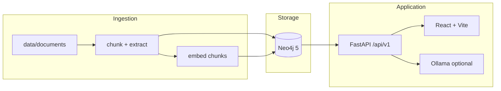

# KG RAG Demo

**Citation-grounded knowledge graph Q&A** — ingest biomedical-style documents, extract entities into Neo4j, retrieve with embeddings, answer via FastAPI + optional local LLM, explore with React.

[](https://github.com/LordKay-sudo/kg-rag-demo/actions/workflows/ci.yml)
[](LICENSE)
[](api/requirements.txt)
[](docker-compose.yml)
[](api/app/main.py)
[](web/package.json)

---

## Overview

KG RAG Demo shows how **unstructured text** becomes **queryable knowledge**: document chunking → rule-based entity extraction → Neo4j graph + vector index → retrieval-augmented answers with source citations.

| Capability | Status |
|------------|--------|
| Neo4j via Docker + Document/Chunk schema | ✅ |
| 10-document seed corpus + ingest pipeline | ✅ |
| Rule-based Gene/Disease/Drug extraction | ✅ |
| Chunk embeddings (MiniLM) + vector search | ✅ |
| `POST /ask` with Ollama or retrieval fallback | ✅ |
| React Ask + Corpus + About UI | ✅ |
| Full Docker Compose stack | ✅ |
| GitHub Actions CI | ✅ |

**Corpus (MVP):** 10 synthetic biomedical-style abstracts in `data/documents/`. Suitable for demos; not clinical-grade.

Pairs with [BioInsight Graph](https://github.com/LordKay-sudo/bioinsight-graph) (structured Open Targets–style associations).

---

## Quick start

**Prerequisites:** [Docker Desktop](https://www.docker.com/products/docker-desktop/), Python 3.11+ (`py -3`), Node.js 20+. Optional: [Ollama](https://ollama.com/) for richer LLM answers.

```bash
git clone https://github.com/LordKay-sudo/kg-rag-demo.git
cd kg-rag-demo
cp .env.example .env

# 1 — Graph database (ports 7475 / 7688 to avoid clash with bioinsight)
docker compose up -d neo4j

# 2 — Seed + ingest (from repo root)
cd api && py -3 -m venv .venv
.\.venv\Scripts\pip install -r requirements.txt
cd ..
.\api\.venv\Scripts\python scripts\seed_documents.py
.\api\.venv\Scripts\python scripts\ingest_all.py

# 3 — API
cd api
.\.venv\Scripts\uvicorn app.main:app --reload --port 8001

# 4 — Web (new terminal)
cd web && npm install && npm run dev
```

| Service | URL |
|---------|-----|
| Web UI | http://localhost:5173 |
| API docs | http://localhost:8001/docs |
| Neo4j Browser | http://localhost:7475 (`neo4j` / `changeme`) |

Try: *"What is the link between BRCA1 and breast cancer?"* in the Ask view.

### Docker (all-in-one)

Runs Neo4j, seeds + ingests corpus, API, and nginx-served web UI:

```bash
docker compose up --build
```

| Service | URL |
|---------|-----|
| **Web UI** | http://localhost:8081 |
| API docs | http://localhost:8001/docs (also proxied at http://localhost:8081/docs) |
| Neo4j Browser | http://localhost:7475 |

The `seed` service runs once per `compose up` (loads documents + full ingest). To re-seed:

```bash
docker compose run --rm seed
```

**Ollama (optional):** With Ollama running on the host (`ollama pull llama3.2`), the API container reaches it via `host.docker.internal:11434`. Without Ollama, `/ask` still returns retrieval-based answers.

---

## Architecture



---

## Graph model

```cypher
(:Document {id, title, source, status, ingested_at})
(:Chunk {id, document_id, text, index})
(:Gene {id, symbol})
(:Disease {id, name})
(:Drug {id, name})

(:Chunk)-[:FROM_DOCUMENT]->(:Document)
(:Chunk)-[:MENTIONS]->(:Gene|:Disease|:Drug)
(:Gene)-[:ASSOCIATED_WITH]->(:Disease)
(:Drug)-[:TREATS]->(:Disease)
```

Chunk embeddings are stored for vector similarity search at query time.

---

## API

Base path: `/api/v1`

| Method | Path | Description |
|--------|------|-------------|
| GET | `/health` | API, Neo4j, LLM provider status |
| GET | `/documents` | List ingested documents |
| POST | `/ingest/{document_id}` | Chunk, extract, embed one document |
| POST | `/ask` | `{ "question": "..." }` → answer + citations + entities |

Example `/ask` response:

```json
{
  "answer": "Gene BRCA1 is associated with breast cancer in document doc-001.",
  "citations": [{ "chunk_id": "chunk-12", "document_id": "doc-001", "snippet": "..." }],
  "entities": [{ "type": "Gene", "id": "BRCA1" }],
  "subgraph": { "nodes": [], "edges": [] }
}
```

Interactive docs: http://localhost:8001/docs

---

## Configuration

Copy `.env.example` to `.env`:

```env
NEO4J_URI=bolt://localhost:7688
NEO4J_USER=neo4j
NEO4J_PASSWORD=changeme

LLM_PROVIDER=ollama
OLLAMA_BASE_URL=http://localhost:11434
OLLAMA_MODEL=llama3.2

EMBEDDING_MODEL=sentence-transformers/all-MiniLM-L6-v2
CHUNK_SIZE=500
CHUNK_OVERLAP=80
TOP_K_CHUNKS=5
```

---

## Project layout

```text
kg-rag-demo/
├── api/                 # FastAPI app, ingest, RAG
├── web/                 # React UI (Ask, Corpus, About)
├── scripts/             # seed_documents.py, ingest_all.py
├── data/documents/      # seed corpus (doc-001 … doc-010)
├── prompts/             # LLM prompt templates
├── docker-compose.yml
└── Dockerfile.seed
```

---

## Development

```bash
# API tests (mocked Neo4j)
cd api && pytest -q

# Web production build
cd web && npm run build
```

---

## Relation to BioInsight Graph

| Project | Focus |
|---------|--------|
| [bioinsight-graph](https://github.com/LordKay-sudo/bioinsight-graph) | Structured public datasets → graph → explore |
| **kg-rag-demo** | Unstructured text → graph + embeddings → Q&A |

---

## License

MIT — see [LICENSE](LICENSE).
