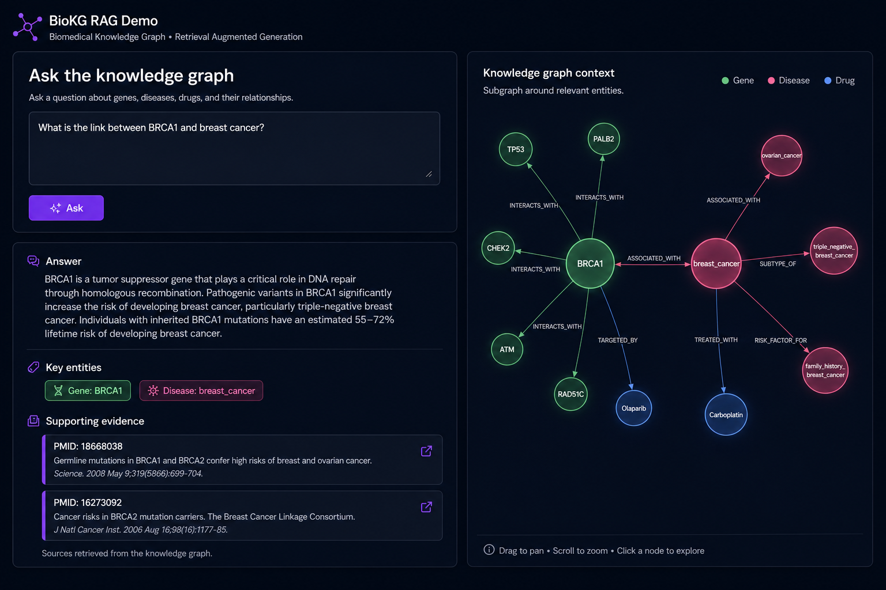
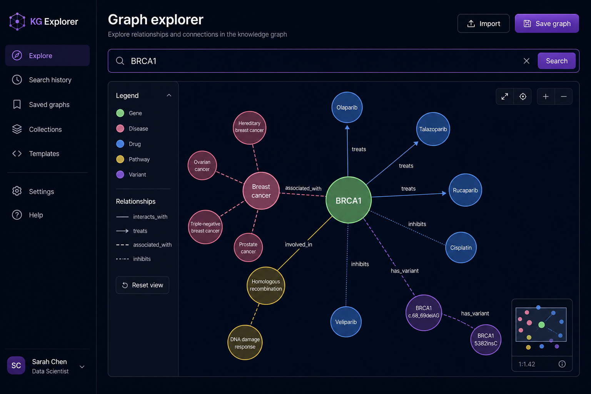
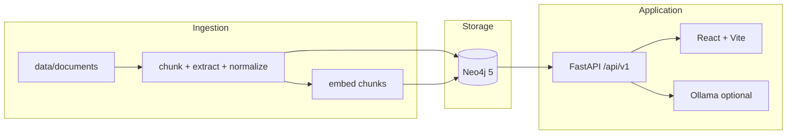

# KG RAG Demo

**Citation-grounded knowledge graph Q&A** — ingest biomedical-style documents, extract entities into Neo4j, retrieve with embeddings, answer via FastAPI + optional local LLM, explore with React.

[](https://github.com/LordKay-sudo/kg-rag-demo/actions/workflows/ci.yml)
[](LICENSE)
[](api/requirements.txt)
[](docker-compose.yml)
[](api/app/main.py)
[](web/package.json)

---

> **Disclaimer:** This is a **demonstration** built on a synthetic corpus — **not real publications and not clinical-grade**. Extracted associations are illustrative, not causal. Do not use for diagnosis or treatment decisions. See [PROVENANCE.md](PROVENANCE.md).

## Overview

KG RAG Demo shows how **unstructured text** becomes **queryable knowledge**: document chunking → rule-based entity extraction → Neo4j graph + vector index → retrieval-augmented answers with source citations.

| Capability | Status |
|------------|--------|
| Neo4j via Docker + Document/Chunk schema | ✅ |
| 10-document seed corpus + ingest pipeline | ✅ |
| Rule-based Gene/Disease/Drug extraction | ✅ |
| Chunk embeddings (MiniLM) + vector search | ✅ |
| `POST /ask` with Ollama or retrieval fallback | ✅ |
| Citations with doc title + PMID/DOI/Europe PMC links | ✅ |
| Shared ENSG/EFO/MONDO IDs with BioInsight | ✅ |
| Entity-biased ask (`gene_id` / `disease_id`) | ✅ |
| Chunk audit trail + extraction provenance (confidence, version) | ✅ |
| Plan-aware RAG: `/ask/plan`, conditional widen, synonym expand, compact mode | ✅ |
| React Ask + Corpus + About UI | ✅ |
| `GET /graph/explore` + force-directed graph UI | ✅ |
| Corpus upload + per-document ingest from browser | ✅ |
| Full Docker Compose stack | ✅ |
| GitHub Actions CI | ✅ |

**Corpus (MVP):** 10 synthetic biomedical-style abstracts in `data/documents/` (clearly marked, not real publications). Suitable for demos; not clinical-grade. See [PROVENANCE.md](PROVENANCE.md).

Pairs with [BioInsight Graph](https://github.com/LordKay-sudo/bioinsight-graph) (structured Open Targets–style associations). Roadmap: [docs/ROADMAP.md](docs/ROADMAP.md) · Ecosystem handoff: [ECOSYSTEM_CONTEXT](https://github.com/LordKay-sudo/bioinsight-graph/blob/main/docs/ECOSYSTEM_CONTEXT.md).





---

## Quick start

**Prerequisites:** [Docker Desktop](https://www.docker.com/products/docker-desktop/), Python 3.11+ (`py -3`), Node.js 20+. Optional: [Ollama](https://ollama.com/) for richer LLM answers.

```bash
git clone https://github.com/LordKay-sudo/kg-rag-demo.git
cd kg-rag-demo
cp .env.example .env

# 1 — Graph database (ports 7475 / 7688 to avoid clash with bioinsight)
docker compose up -d neo4j

# 2 — Seed + ingest (from repo root)
cd api && py -3 -m venv .venv
.\.venv\Scripts\pip install -r requirements.txt
cd ..
.\api\.venv\Scripts\python scripts\seed_documents.py
.\api\.venv\Scripts\python scripts\ingest_all.py

# 3 — API
cd api
.\.venv\Scripts\uvicorn app.main:app --reload --port 8001

# 4 — Web (new terminal)
cd web && npm install && npm run dev
```

| Service | URL |
|---------|-----|
| Web UI | http://localhost:5173 |
| API docs | http://localhost:8001/docs |
| Neo4j Browser | http://localhost:7475 (`neo4j` / `changeme`) |

Try: *"What is the link between BRCA1 and breast cancer?"* in the Ask view.

### Docker (all-in-one)

Runs Neo4j, seeds + ingests corpus, API, and nginx-served web UI:

```bash
docker compose up --build
```

| Service | URL |
|---------|-----|
| **Web UI** | http://localhost:8081 |
| API docs | http://localhost:8001/docs (also proxied at http://localhost:8081/docs) |
| Neo4j Browser | http://localhost:7475 |

The `seed` service runs once per `compose up` (loads documents + full ingest). To re-seed:

```bash
docker compose run --rm seed
```

**Ollama (optional):** With Ollama running on the host (`ollama pull llama3.2`), the API container reaches it via `host.docker.internal:11434`. Without Ollama, `/ask` still returns retrieval-based answers.

---

## Architecture


```mermaid
flowchart LR
  subgraph ingest [Ingestion]
    DOC[data/documents]
    EXT[chunk + extract + normalize]
    EMB[embed chunks]
  end
  subgraph store [Storage]
    N4j[(Neo4j 5)]
  end
  subgraph serve [Application]
    API[FastAPI /api/v1]
    WEB[React + Vite]
    LLM[Ollama optional]
  end
  DOC --> EXT --> N4j
  EXT --> EMB --> N4j
  N4j --> API
  API --> LLM
  API --> WEB
```

---

## Graph model

```cypher
(:Document {id, title, source, status, ingested_at, pmid, doi, url})
(:Chunk {id, document_id, text, index})
(:Gene {id, symbol, ontology_id})      // ontology_id = Ensembl ENSG (BioInsight join key)
(:Disease {id, name, ontology_id})     // ontology_id = EFO / MONDO
(:Drug {id, name})

(:Chunk)-[:FROM_DOCUMENT]->(:Document)
(:Chunk)-[:MENTIONS]->(:Gene|:Disease|:Drug)
(:Gene)-[:ASSOCIATED_WITH]->(:Disease)
(:Drug)-[:TREATS]->(:Disease)
```

Chunk embeddings are stored for vector similarity search at query time.

### Extraction schema and normalization (R16–R17)

Text-derived entities follow a compact ontology \(S = (E, R, \Phi)\) documented in
[`docs/EXTRACTION_SCHEMA.md`](docs/EXTRACTION_SCHEMA.md). The ingest pipeline is:

1. **Extract** — rule-based allowlists in [`api/app/ingest/extractor.py`](api/app/ingest/extractor.py)
2. **Normalize** — alias merge + dedupe in [`api/app/ingest/normalize.py`](api/app/ingest/normalize.py)
3. **Resolve** — `ENSG` / EFO / MONDO via [`api/app/identifiers.py`](api/app/identifiers.py)
4. **Write** — Neo4j nodes and `MENTIONS` edges in [`api/app/ingest/pipeline.py`](api/app/ingest/pipeline.py)

### Shared identifiers with BioInsight

Extracted genes resolve to **Ensembl `ENSG`** ids and diseases to **EFO/MONDO** ids via
[`api/app/identifiers.py`](api/app/identifiers.py) — the same stable keys
[BioInsight Graph](https://github.com/LordKay-sudo/bioinsight-graph) uses, so the same
symbol points to the same node id in both repos (e.g. `BRCA1` → `ENSG00000012048`).

### Document source metadata

Document files carry an optional header that powers clickable citations:

```text
Title: BRCA1 and breast cancer risk
Source: Europe PMC
PMID: 20301425
DOI: 10.1000/example
URL: https://europepmc.org/article/MED/20301425

<body text>
```

Citations resolve a `reference_url` preferring `URL` > `DOI` (doi.org) > `PMID`
(Europe PMC), falling back to a Europe PMC title search when no id is present.

---

## API

Base path: `/api/v1`

| Method | Path | Description |
|--------|------|-------------|
| GET | `/health` | API, Neo4j, LLM provider status + demo disclaimer |
| GET | `/documents` | List ingested documents |
| GET | `/documents/{id}/chunks` | Audit trail: chunks + extracted entities + reference link |
| POST | `/documents` | Upload `.txt` / `.md` (multipart) |
| POST | `/ingest/{document_id}` | Chunk, extract, embed one document |
| POST | `/ask/plan` | Decompose question → sub-queries + entity hints (R9) |
| POST | `/ask` | `{ "question", "gene_id"?, "disease_id"?, "weak_graph_evidence"?, "compact"? }` → answer + citations |
| GET | `/graph/explore?entity_id=` | One-hop subgraph around an entity |

`gene_id` / `disease_id` are optional and accept either a symbol/slug (`BRCA1`,
`breast_cancer`) or a shared ontology id (`ENSG00000012048`, `EFO_0000305`); when set,
chunks mentioning that entity are boosted in retrieval.

Example `/ask` response:

```json
{
  "answer": "BRCA1 is associated with breast cancer [chunk:doc-001-chunk-0].",
  "citations": [{
    "chunk_id": "doc-001-chunk-0",
    "document_id": "doc-001",
    "document_title": "BRCA1 and breast cancer risk",
    "source": "Synthetic demo abstract (not a real publication)",
    "snippet": "BRCA1 mutations substantially increase ...",
    "pmid": null,
    "doi": null,
    "reference_url": "https://europepmc.org/search?query=BRCA1+and+breast+cancer+risk"
  }],
  "entities": [{ "type": "Gene", "id": "BRCA1", "ontology_id": "ENSG00000012048" }],
  "subgraph": { "nodes": [], "edges": [] },
  "insufficient_evidence": false,
  "expanded_question": "What links BRCA1 to breast cancer?"
}
```

**Plan-first workflow (R9):** `POST /ask/plan` returns sub-queries and `widen_retrieval` hint before calling `/ask`. Set `weak_graph_evidence: true` (or configure `BIOINSIGHT_API_URL`) to widen retrieval when structured graph evidence is sparse (R10). Use `compact: true` for fewer/shorter citations with an honest `insufficient_evidence` flag (R12).

Interactive docs: http://localhost:8001/docs

---

## Configuration

Copy `.env.example` to `.env`:

```env
NEO4J_URI=bolt://localhost:7688
NEO4J_USER=neo4j
NEO4J_PASSWORD=changeme

LLM_PROVIDER=ollama
OLLAMA_BASE_URL=http://localhost:11434
OLLAMA_MODEL=llama3.2

EMBEDDING_MODEL=sentence-transformers/all-MiniLM-L6-v2
CHUNK_SIZE=500
CHUNK_OVERLAP=80
TOP_K_CHUNKS=5
```

---

## Project layout

```text
kg-rag-demo/
├── api/                 # FastAPI app, ingest, RAG
├── web/                 # React UI (Ask, Corpus, About)
├── notebooks/           # BRCA1 structured-vs-literature walkthrough (R8)
├── scripts/             # seed_documents.py, ingest_all.py
├── data/documents/      # seed corpus (doc-001 … doc-010)
├── prompts/             # LLM prompt templates
├── docker-compose.yml
└── Dockerfile.seed
```

---

## Development

```bash
# API tests (mocked Neo4j)
cd api && pytest -q

# Web production build
cd web && npm install && npm run build

# README screenshots (API + web dev servers running, corpus ingested)
node scripts/capture_screenshots.mjs
```

### Roadmap

| Phase | Deliverable | Status |
|-------|-------------|--------|
| 0 | Scaffold, Neo4j, Document/Chunk schema | ✅ |
| 1 | Chunk + ingest API + list documents | ✅ |
| 2 | Rule-based extractor → MENTIONS edges | ✅ |
| 3 | Embeddings + vector search | ✅ |
| 4 | RAG `/ask` with Ollama or fallback | ✅ |
| 5 | React Ask UI + citation panels | ✅ |
| 6 | Graph explorer + Docker + README screenshots | ✅ |
| 7 | Citations w/ PMID/DOI links (R1/R2) + shared ENSG/EFO ids & biased ask (R5/R6) | ✅ |
| 8 | Chunk audit + disclaimer (R3/R4), extraction provenance (R7), BRCA1 notebook (R8) | ✅ |
| 9 | Plan-aware RAG: `/ask/plan`, conditional widen (R10), synonyms (R11), compact mode (R12) | ✅ |
| 10 | Europe PMC OA corpus download + batch ingest + retrieval benchmarks (R13–R15) | ✅ |
| 11 | Extraction schema + post-extract normalization (R16–R17) | ✅ |

---

## Relation to BioInsight Graph

| Project | Focus |
|---------|--------|
| [bioinsight-graph](https://github.com/LordKay-sudo/bioinsight-graph) | Structured public datasets → graph → explore · [ROADMAP](https://github.com/LordKay-sudo/bioinsight-graph/blob/main/docs/ROADMAP.md) |
| [embabel-mcp](https://github.com/LordKay-sudo/embabel-mcp) | MCP on BioInsight API · [ROADMAP](https://github.com/LordKay-sudo/embabel-mcp/blob/main/docs/ROADMAP.md) |
| **kg-rag-demo** | Unstructured text → graph + embeddings → Q&A · [ROADMAP](docs/ROADMAP.md) |

---

## License

MIT — see [LICENSE](LICENSE).
